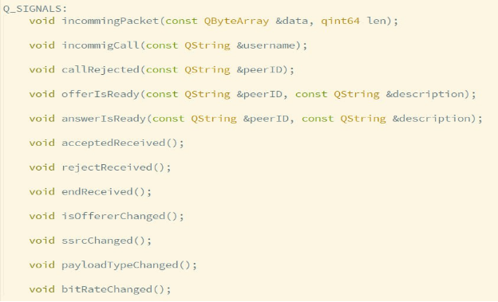
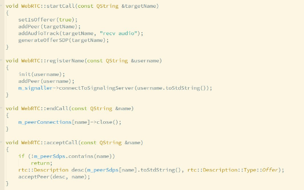
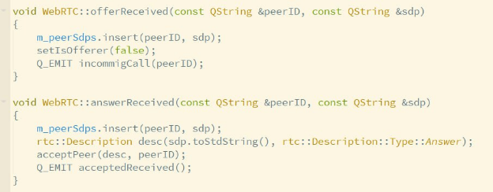
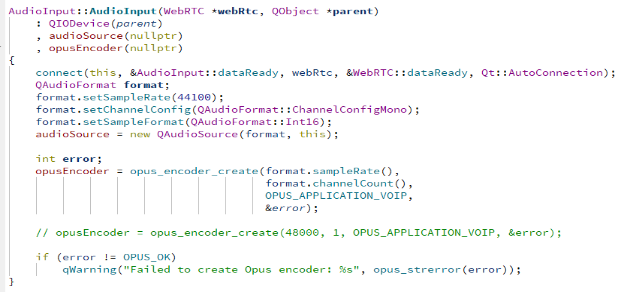
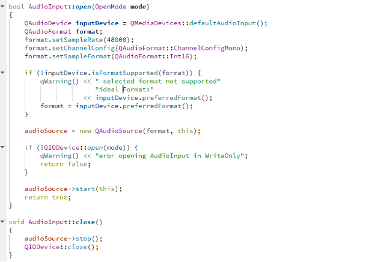
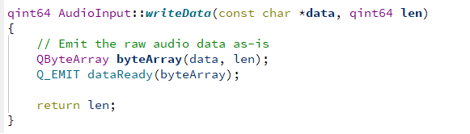
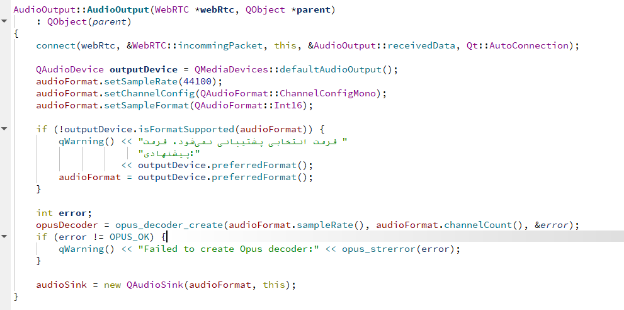
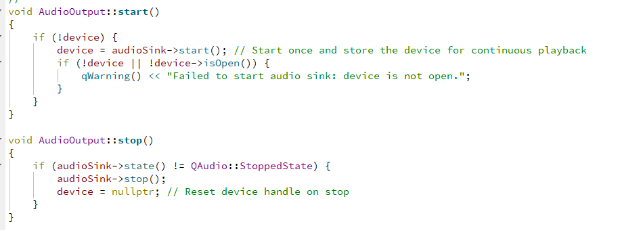
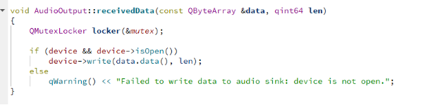

**گزارش پروژه اول شبکه – پاییز 1403**

**محمدعلی قهاری 810100201
رضا عبدلی 810100251**

**سوالات تئوری:**

:WebRTC

WebRTC یک فناوری برای ایجاد ارتباطات بلادرنگ (صدا، تصویر، و داده) بین کاربران بدون نیاز به نصب افزونه است. WebRTC به صورت پیش‌فرض از ارتباط P2P پشتیبانی می‌کند و برای کاربردهایی مانند تماس تصویری و صوتی مناسب است.

\- مزایا: ارتباط مستقیم و بلادرنگ، بدون نیاز به افزونه.

\- معایب: نیاز به راهکاری برای عبور از NAT و فایروال‌ها.

:Coturn

Coturn سروری است که پروتکل‌های STUN و TURN را اجرا می‌کند و برای حل مشکلات NAT و فایروال‌ها در ارتباطات WebRTC استفاده می‌شود. این سرور به دستگاه‌ها کمک می‌کند تا آدرس عمومی خود را تشخیص دهند یا داده‌ها را از طریق سرور واسطه ارسال کنند.

\- مزایا: قابلیت اطمینان بیشتر در ارتباطات WebRTC حتی در شبکه‌های محدود.

\- معایب: نیاز به منابع سرور، تأخیر بیشتر هنگام استفاده از TURN.

:STUN

پروتکل STUN به دستگاه‌ها کمک می‌کند تا آدرس عمومی خود را شناسایی کرده و برای ارتباط مستقیم P2P استفاده کنند.

\- مزایا: کاهش تأخیر و منابع سرور به دلیل ارتباط مستقیم.

\- معایب: در شبکه‌های پیچیده کارایی ندارد.

:TURN

پروتکل TURN زمانی استفاده می‌شود که ارتباط مستقیم ممکن نباشد. در این حالت، داده‌ها از طریق سرور TURN منتقل می‌شوند.

\- مزایا: ارتباط پایدار حتی در شبکه‌های محدود.

\- معایب: افزایش تأخیر و هزینه به دلیل عبور داده‌ها از سرور واسطه.

Signaling Server:
برای هماهنگی اولیه بین کاربران در WebRTC استفاده می‌شود. این سرور اطلاعاتی مانند IP، پورت و کلیدهای امنیتی را بین کاربران رد و بدل می‌کند تا ارتباط مستقیم برقرار شود. پس از برقراری ارتباط، دیگر نیازی به Signaling Server نیست.

\- مزایا: ارتباط سریع‌تر: به کاربران کمک می‌کند تا سریع‌تر اطلاعات اولیه را رد و بدل کنند و ارتباط برقرار کنند
\- معایب: نیاز به امنیت بالا: چون اطلاعات حساس اولیه از طریق آن رد و بدل می‌شود، باید از پروتکل‌های امنیتی قوی برای جلوگیری از دسترسی‌های غیرمجاز استفاده شود

**بررسی webrtc**

پروتکلی است که در آن دو کلاینت بدون نیاز به یک سرور برای ارتباط با آن ، مستقیم با هم ارتباط میگیرند و پیام و اطلاعات خود را جابجا میکنند . در این روش ، دو کلاینت ابتدا بوسیله یک signaling server با هم ارتباط میگیرند و SDP , candidate را با هم به اشتراک میگذارند . این ویژگی ها که در ادامه توضیح داده میشود ، باعث میشود دو کلاینت با همدیگر مستقیم ارتباط بگیرند و سرور از ارتباط حذف شود. اینکار باعث میشود تاخیر به حداقل برسد .

**ویژگی ice**

یکی از مزیت‌های این پروتکل ، ICE یا Interactive Connectivity Establishment است. ICE پروتکلی است که مشکلات NAT و فایروال را برای ارتباط peer-to-peer از میان برمی‌دارد. این روش بدین صورت عمل می کند که طرفین ارتباط با اشتراک گذاری مسیرهایی که می توانند با هم ارتباط برقرار کنند ( که به هر کدام یک candidate گفته می شود) بهترین مسیر برای برقراری ارتباط را تشخیص می دهند و با حذف موانع ذکر شده در بالا با هم ارتباط را برقرار می کنند.

**ویژگی sdp**

پروتکل Session Description Protocol پروتکلی است که به وسیله آن امکان ارسال فایل های چند رسانه ای در بستر WebRTC امکان پذیر می شود. در واقع این پروتکل باعث ایجاد زبان مشترک بین دو دستگاه می شود و دو دستگاه با به اشتراک گذاری sdp هایشان با هم از نوع فایلی که قرار است ارسال شود، پروتکلی که تحت آن پیام ها ارسال می شود ، codec و سایر تنظیمات لازم برای برقراری ارتباط آگاه می شوند.

**توضیح کد:

:WebRtc

این سیگنال های WebRtc هست که ما اونایی که استفاده نشدن رو حذف کردیم مثل زمانی که یک sdp ساخته میشه که کامل نیست(هنوز gathering state تغییر نکرده، چون ما فقط اون SDP آخر برامون مهمه که ارسالش کنیم)

بخشی از این سیگنال ها به کلاس سیگنال منیجر وصل میشه که کار های ار تباط با سیگنالینگ سرور رو هندل میکنه و اکثرشون به یوآی برنامه میرن و اولیشون هم برای صدا هست که از طریق اسپیکر پخش بشه.
کلیت کار اینجوریه که ابتدا با یک اسم داخل سیگنالینگ سرور رجیستر میشیم(اسم رو خودمون انتخاب میکنیم) بعد میتونیم اسم طرف مقابل رو وارد کنیم تا با اون ارتباط بگیریم و قتی این کارو میکنیم peer طرف رو با اون اسمی که وارد کردیم میسازیم بعد که افر اماده شد از طریق سرور به طرف مقابل میدیم.

بعد طرف که درسافت کرد بهش پیام میدیم که قبول میکنه یا رد، اگه رد کرد که باز از طریق سرور پیام میدیم و همه چیو میبندیم ولی اگه قبول کرد اون طرف میاد peer این یکی رو میسازه و sdp دریافتی رو بهش الصاق میکنه تا answerer خودش ساخته بشه که بعد از ساختش اونو از طریق سرور ارسال میکنیم بعد در نهایت دو طرف به استیت 2 یعنی متصل میرن که اون موقع میایم میکروفون و اسپیکر رو فعال میکنیم تا به محض اماده شدن پکت اونو ارسال و دریافت کنیم(بدون سرور).

این وسط هم پکت ها از طریق track ها که قبل از جنریت کردن sdp ها ساخته میشن ارسال میشن

این طوری که افرر میاد ترک میسازه با مود sendrecv، بعد طرف مقابل هم میاد بعد از دریافت sdp ترک میسازه
**

**AudioInput:**

کلاس AudioInput  مسئول دریافت ورودی صوتی از میکروفون، پردازش و ارسال داده‌های صوتی از طریق کلاس WebRTC  به کاربر مقصد(که در اینجا منظور AudioOutput می باشد)است.

در این کد، یک سیگنال dataReady  داریم که به اسلات dataReady در کلاس WebRTC متصل شده است. این به این معناست که هر زمان داده‌ی صوتی آماده ارسال شود (مثلاً در زمان فراخوانی تابع (writeData)، AudioInput سیگنالی به WebRTC می‌فرستد و به آن اطلاع می‌دهد که داده جدیدی آماده پردازش یا ارسال است.

در این متود فرمت صوتی، شامل Sample Rate، Channel Config و سپس منبع صوتی بر اساس فرمت تعریف‌شده را تنظیم میکنیم
در اینجا یک انکدر Opus برای کدگذاری نیز ایجاد کرده ایم اما به دلیل کرش برنامه نتوانستیم از آن(در تابع writeDataکه در ادامه توضیح میدهیم) استفاده کنیم.

در متود open() این کلاس ابتدا دستگاه ورودی صوتی پیش‌ فرض (میکروفون) را تنظیم میکنیم. (QMediaDevices::defaultAudioInput()) سپس با استفاده از isFormatSupported  از سازگاری فرمت با میکروفون اطمینان حاصل میکنیم. اگر فرمت پشتیبانی نشود، از فرمت پیشنهادی سیستم استفاده میکنیم. سپس شروع به ضبط صوت با استفاده از audioSource و ارسال مستقیم داده‌ها به writeData.میکنیم.
در متود close() هم این تابع audioSource را متوقف کرده و QIODevice را می‌بندیم.

در این نسخه از متود writeDataکه نوشتیم داده‌های صوتی بدون رمزگذاری ارسال میشوند. داده‌ها به صورت خام به QByteArray تبدیل شده و از طریق سیگنال dataReady به WebRTC ارسال می‌شوند.

نسخه کامنت‌شده این تابع که شامل رمزگذاری Opus است پایین همین قطعه کد موجود است اما به دلیل کرش توسط کالر(offerer). نتوانستیم از آن استفاده کنیم.

تابع readData() از کلاس AudioInput هم مورد نیاز نیست و پیاده‌سازی نمی‌شود، چون نیازی به خواندن داده از دستگاه خروجی نیست.

**AudioOutput:**

کلاس audiooutput برای دریافت و پخش صدای دریافتی از طرف مقابل(audioinput) طراحی شده است که  از QAudioSink برای پخش صدا استفاده میکند. به دلیل مشابه در اینجا هم از opus استفاده نکردیم.

در constructor  سیگنال incommingPacket از کلاس WebRTC را به اسلات receivedData در AudioOutput متصل می‌کند. این اتصال به این معناست که هر زمان داده صوتی دریافتی از شبکه آماده شد، این داده به AudioOutput منتقل و در receivedData پردازش می‌شود. 

QMediaDevices::defaultAudioOutput() دستگاه صوتی خروجی پیش‌فرض را که بلندگو یا هدفون است، انتخاب می‌کند.

فرمت صوتی را نیز با نرخ نمونه برداری 441000 تنظیم کردیم که نشان دهنده تعداد نمونه هایی است که هر ثانیه از سیگنال صوتی گرفته میشود. فرمت داده ۱۶ بیتی نیز به این معنی است که هر نمونه از صدا با ۱۶ بیت داده ذخیره می‌شود. این حالت به کیفیت بالای صدا کمک میکند. در اینجا در صورتی که دستگاه خروجی از این فرمت پشتیبانی نکند، فرمت پیشنهادی دستگاه به‌جای آن استفاده می‌شود.
` `در نهایت QAudioSink برای پخش صدا از دستگاه خروجی استفاده می‌شود و فرمت تنظیم شده را به عنوان پارامتر ورودی میگیرد.

متود start() QAudioSink را راه‌اندازی کرده و دستگاه خروجی را برای پخش صدا آماده می‌کند. متد stop() هم پخش صدا را متوقف کرده و ابجکت دستگاه را به nullptr تنظیم می‌کند.

اسلات receivedData() داده‌ی دریافتی از WebRTC را دریافت و با استفاده از device->write به دستگاه صوتی ارسال می‌کند. در این قسمت باتوجه به اینکه device->write(data.data(), len); می‌تواند توسط Thread های مختلف هم‌زمان فراخوانی شود، این بخش از QMutexLocker استفاده می‌کند تا مطمئن شود دسترسی به داده در این بخش از کد Synchronization  ندارد و ممانعت از تداخل در دسترسی به داده‌ها را تضمین می کند.
